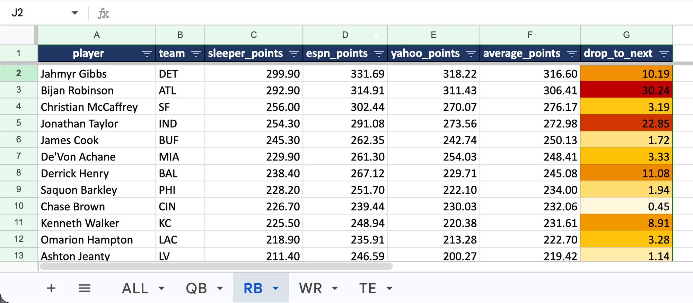

# Fantasy Football Projection Aggregator

Pulls **half-PPR season projections** for every QB, RB, WR, and TE from three
sources (**Sleeper, ESPN, and Yahoo**), matches players across them, averages
the projections, and builds a ready-to-draft board as a formatted Excel
workbook.

No single site's projections are gospel, so averaging three of them gives you a
more stable ranking to draft from. A player is only ranked once **all three**
sites have a projection for him; a missing source is never treated as zero.

> **Built for draft day.** Run it before your draft. Once the season starts,
> sites zero out season projections for injured players (OUT, IR), so those
> players fall off the board.

---

## What you get

One file: **`output/fantasy_draft_board.xlsx`**. The `output/` folder isn't in
the repo; it's created the first time you run the tool, and each run refreshes
it with the latest projections.



*The RB sheet. Darker `drop_to_next` cells mark tier cliffs, like the 30-point
drop after Bijan Robinson.*

| Sheet | What's in it |
|-------|--------------|
| **ALL** | The **199-player draft board**, every position, ranked by average |
| **QB / RB / WR / TE** | The board split by position, plus a **`drop_to_next`** column |

Every sheet shows each site's projection side by side with the average.
`drop_to_next` is how many projected points a player is worth *over the next
player at his position*, so you can spot tier cliffs on draft day (e.g. a
20-point drop after TE2). Headers are frozen and filtered, point columns show
two decimals, and `drop_to_next` is color-scaled so big drop-offs stand out.

---

## How it works

```
Sleeper ─┐
ESPN  ───┼─►  match names  ─►  average (all 3 required)  ─►  draft board  ─►  .xlsx
Yahoo ───┘
```

1. **Collect** up to 500 players from each source, caching each download in
   `output/raw/`.
2. **Match names** so `A.J. Brown`, `AJ Brown`, and `A.J. Brown Jr.` line up
   across sites (handles suffixes, punctuation, and a few known aliases).
3. **Average**: `average_points = (sleeper + espn + yahoo) / 3`, but *only*
   when all three exist. Missing projections stay blank, never zero.
4. **Build the board**: rank players **within each position**, keep a
   configurable number per position (default 24 QB / 70 RB / 85 WR / 20 TE =
   199), then sort the combined board by average. Ranking within position first
   stops high QB point totals from crowding out RB/WR/TE.
5. **Write the workbook**: the full board plus one sheet per position.

---

## Requirements

- Python 3.9+
- The packages in `requirements.txt`
- Your own **ESPN** and **Yahoo** fantasy leagues. Both sites serve projections
  through your league pages, so the tool needs your league IDs and login
  cookies. Sleeper needs nothing.

---

## Setup

### 1. Clone and install

```bash
git clone https://github.com/gforrest-personal/ff-projections.git
cd ff-projections
python3 -m venv .venv && source .venv/bin/activate   # Windows: .venv\Scripts\activate
pip install -r requirements.txt
```

### 2. Add your league IDs and credentials

Copy the template and fill in your values:

```bash
cp .env.example .env
```

Then edit `.env`. Here's how to find each value:

**League IDs**: open your league on each site; the number in the URL is the ID.
- ESPN: `.../leagues/{ESPN_LEAGUE_ID}/...`
- Yahoo: `.../f1/{YAHOO_LEAGUE_ID}/...`

**ESPN cookies** (`ESPN_SWID` and `ESPN_S2`), only needed for a **private**
league:
1. Log in at [espn.com](https://espn.com).
2. Open DevTools → **Application** → **Cookies** → `espn.com`.
3. Copy the values of `SWID` (keep the curly braces) and `espn_s2`.

**Yahoo cookie**: Yahoo requires a full browser session, kept in a separate
file (not in `.env`):
1. Log in to your Yahoo fantasy league.
2. Open DevTools → **Network** tab, reload the players page.
3. Click any request to `football.fantasysports.yahoo.com`, find the **`Cookie:`**
   request header, and copy the entire value.
4. Paste it into a file named **`yahoo_cookies.txt`** in the project root (one
   line).

> Both `.env` and `yahoo_cookies.txt` are git-ignored, so they will never be
> committed.

---

## Usage

From the project root, run the whole pipeline:

```bash
python -m fantasy_projections
```

This downloads fresh projections from all three sites. When it finishes, a new
`output/` folder appears in the project (in VS Code, look in the Explorer
sidebar; it shows greyed out because git ignores it). Open **`output/fantasy_draft_board.xlsx`** in Excel, Numbers, or Google
Sheets. VS Code can't preview `.xlsx` files, so right-click it and choose
**Reveal in Finder** (macOS) or **Reveal in File Explorer** (Windows).

You can also run one step at a time. Because each download is cached in
`output/raw/`, if one site fails (say, an expired Yahoo cookie) you can fix it,
re-run just that source, and rebuild the workbook without re-fetching the
others:

```bash
python -m fantasy_projections.sources.sleeper   # no credentials needed
python -m fantasy_projections.sources.espn      # needs ESPN_* in .env
python -m fantasy_projections.sources.yahoo     # needs yahoo_cookies.txt + YAHOO_LEAGUE_ID
python -m fantasy_projections.aggregate         # rebuild the workbook from output/raw/
```

---

## Running it with Claude Code

[Claude Code](https://claude.com/claude-code) can set up and run the project for
you, from your terminal or inside VS Code. The repo includes a
[`CLAUDE.md`](CLAUDE.md) that Claude Code reads automatically, so it already
knows the commands, the project layout, and to keep your credentials out of
the chat.

1. Clone the repo and start Claude Code in the project folder:

   ```bash
   git clone https://github.com/gforrest-personal/ff-projections.git
   cd ff-projections
   claude
   ```

2. Ask it to set things up:

   > Set up this project: create a virtual environment, install the
   > requirements, and copy .env.example to .env.

3. Fill in `.env` and `yahoo_cookies.txt` yourself (see
   [Setup](#2-add-your-league-ids-and-credentials)). Paste the cookies straight
   into those files rather than into the chat, since they're login credentials.

4. Ask it to run the tool:

   > Run the pipeline and tell me when the draft board is ready.

Once it's set up, you can also ask things like:

- "Rebuild the workbook from the cached downloads."
- "Change the board size for a 12-team league."
- "Why isn't *player name* on the draft board?"

---

## Configuration

All knobs live in `fantasy_projections/config.py`:

| Setting | Default | Meaning |
|---------|---------|---------|
| `SEASON` | `2026` | Projection year (override in `.env`) |
| `COLLECT_LIMIT` | `500` | Players pulled per source |
| `POSITION_LIMITS` | `24/70/85/20` | Board size per position (sized for a 10-team league) |

To tune the board for a different league size, just edit `POSITION_LIMITS`.

---

## Project structure

```
ff-projections/
├── fantasy_projections/       Python package
│   ├── __main__.py            Entry point: runs the full pipeline end to end
│   ├── config.py              Settings and file paths; loads secrets from .env
│   ├── sources/               One module per projection site
│   │   ├── sleeper.py         Sleeper (public API)
│   │   ├── espn.py            ESPN (espn-api, cookie auth)
│   │   └── yahoo.py           Yahoo (requests + BeautifulSoup scraper)
│   ├── aggregate.py           Match names, merge, average, build the board
│   └── excel_export.py        Format and write the Excel workbook
├── output/                    Generated workbook + raw/ download cache (git-ignored)
├── docs/                      Screenshot used in this README
├── .env.example               Template for your league IDs and ESPN cookies
├── CLAUDE.md                  Project guide for Claude Code
├── LICENSE
├── requirements.txt
└── README.md
```

Data flows one way: `sources/*` cache each site's download in `output/raw/` →
`aggregate` merges them and builds the draft board → `excel_export` writes the
board into the workbook. To add a new site, drop a module in `sources/` that
returns the same columns, then wire it into `aggregate.py` and `__main__.py`.

---

## Troubleshooting

- **`Yahoo redirected to login — cookies are missing or expired`**: Yahoo
  session cookies are short-lived. Grab a fresh one (see Setup) and re-run.
- **`ESPNAccessDenied` / ESPN returns nothing**: your `ESPN_S2`/`SWID` expired
  or the league went private. Refresh the cookies in `.env`.
- **A player is missing from the board**: one of the three sites probably has
  no projection for him, so no average could be computed. This is common once
  the season starts (see *Built for draft day* above). Search the files in
  `output/raw/` to see which site doesn't list him.

---

## Notes

- Projections are **half-PPR, full-season**. Kickers and D/ST are intentionally
  skipped.
- This is a personal side project and is not affiliated with Sleeper, ESPN, or
  Yahoo. Yahoo data is scraped from your own logged-in league view; be
  respectful of their servers (the scraper already rate-limits itself).

---

## Contributing

This is a personal project, but you're welcome to fork it and adapt it for your
own league. Issues and pull requests are welcome, though changes are merged at
the owner's discretion.

---

## License

[MIT](LICENSE)
